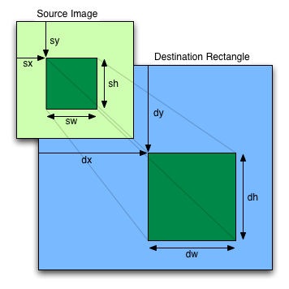

# Animations

Follow the comments in `sketch.js` to create a walking animation for 
a sprite.

Goal is to understand how basic computer animations work and be able to incorporate them into our projects.
```javascript
  // TODO 1 call the image() function to display the character image.
  // image(source, x, y)

  // TODO 2 Adjust the size to display as  d stands for destination
  // (where it will be on the canvas).
  // Make the image display as 64x64 pixels
  // image(source, dX, dY, dW, dH)

  // TODO 3 Adjust the image call again to only display a single
  // frame of the animation. (Each frame is 32x32)
  // image(source, dX, dY, dW, dH, sX, sY, sW, sH)

  // TODO 4 Change modify the image call to advance to the next frame.
  // and the next and the next...

  // TODO 5 Now declare a global variable named cFrame and initialize
  // it to zero modify the sX argument (arg #6) in the image call
  // to be:    cFrame * 32

  // TODO 6 In the draw function increment cFrame by 1.  What happens?

  // TODO 7 Add some code to make the animation reset so the
  // animation loops

  // TODO 8 Declare a variable named cX to store the location
  // of the character increment the cX variable to make the character
  // move across the screen

  // TODO 9 Make the character respawn at the left when it goes off
  // the right side of the canvas

  // TODO 10 Modify the program to use a different sprite or spritesheet
  // More spritesheets can be found at https://opengameart.org

  // TODO Clean up code by removing "Magic Numbers" and replacing
  // them with variables or Constants
```

## Image Resource


`image(img, dx, dy, dWidth, dHeight, sx, sy, [sWidth], [sHeight], [fit], [xAlign], [yAlign])`

| Parameters | Description |
| --- | --- |
`img` | p5.Image|p5.Element|p5.Texture|p5.Framebuffer|p5.FramebufferTexture: image` to display.
`x` | Number: x-coordinate of the top-left corner of the image.
`y` | Number: y-coordinate of the top-left corner of the image.
`width` | Number: width to draw the image.
`height` | Number: height to draw the image.
`dx` | Number: the x-coordinate of the destination rectangle in which to draw the source image
`dy` | Number: the y-coordinate of the destination rectangle in which to draw the source image
`dWidth` | Number: the width of the destination rectangle
`dHeight` | Number: the height of the destination rectangle
`sx` | Number: the x-coordinate of the subsection of the source image to draw into the destination rectangle
`sy` | Number: the y-coordinate of the subsection of the source image to draw into the destination rectangle
`sWidth` | Number: the width of the subsection of the source image to draw into `the destination rectangle
`sHeight` | Number: the height of the subsection of the source image to draw into the destination rectangle
`fit` | Constant: either CONTAIN or COVER
`xAlign` | Constant: either LEFT, RIGHT or CENTER default is CENTER
`yAlign` | Constant: either TOP, BOTTOM or CENTER default is CENTER
   

This lesson was adapted from the video: https://youtu.be/CY0HE277IBM.
Note that we are using P5JS instead of vanilla Javascript and will be creating a simplified version of the program.


